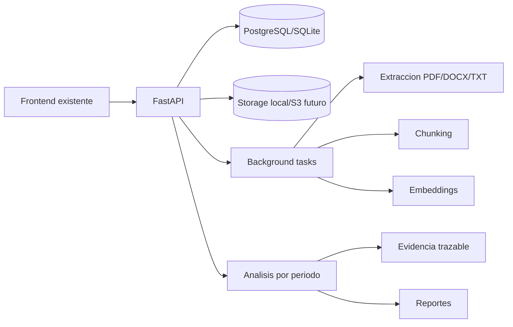

# Arquitectura tecnica

Esta base implementa una evolucion del mockup hacia una plataforma con backend real,
procesamiento documental, evidencia trazable y APIs para dashboard.

## Componentes

## Lo implementado

- Backend FastAPI bajo `backend/app`.
- Modelo de datos inicial para usuarios, roles, periodos, mallas, cursos,
  competencias, criterios, documentos, versiones, chunks, embeddings, evidencias,
  resultados, reportes y auditoria.
- Seed automatico desde `Matriz Tributacion PE 2025 COMPUTACION.xlsx`.
- Carga de documentos PDF, DOCX y TXT.
- Extraccion de texto seleccionable en PDF, DOCX y TXT.
- Estado `ocr_required` cuando no se puede extraer texto.
- Chunking con pagina y offsets por palabra.
- Embeddings semanticos locales con `BAAI/bge-m3` mediante Sentence-Transformers.
- Scoring hibrido por similitud vectorial, cobertura lexica, frases clave y senales de seccion academica.
- Evidencia con fragmento de origen y razones de coincidencia.
- API para matriz, periodos, documentos, analisis, evidencia, reportes y usuario demo.

## Pendiente para produccion

- Agregar OCR efectivo con Tesseract, Azure Document Intelligence, Textract o equivalente.
- Agregar migraciones Alembic.
- Reemplazar BackgroundTasks por Celery/RQ cuando el volumen lo requiera.
- Integrar SSO institucional.
- Agregar antivirus para archivos subidos.
- Crear suite de pruebas con documentos historicos etiquetados.
